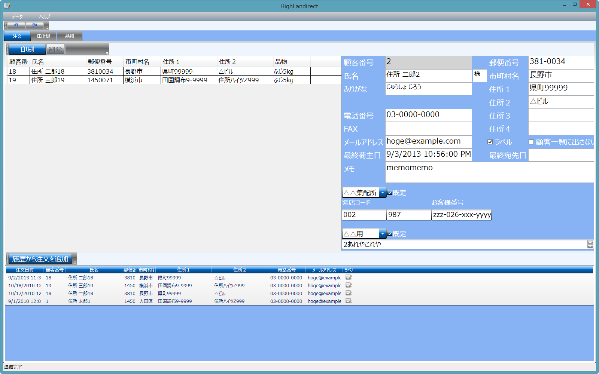

HighLandirect
===================
下記の機能があります。

* 宛名管理
* ヤマトの4.5インチ連帳伝票の印刷と印刷履歴管理
* 顧客台帳の印刷

主に私の両親が使います。

データベースはSQL Server Compact を使っています。WPFのフレームワークにはLivetを使っています。
Livetに関する情報はまだ少ないので、詰まっている方の助けになれば幸いです。

